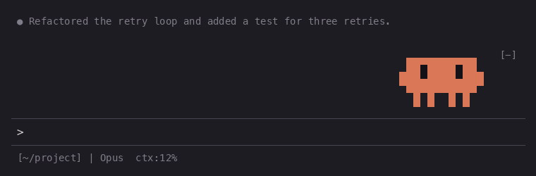
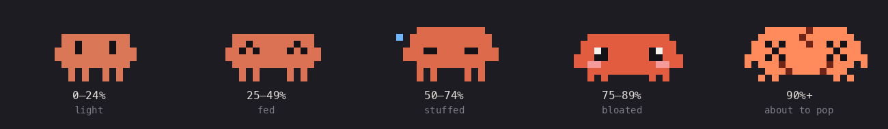
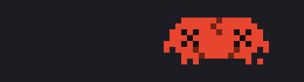
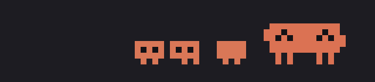
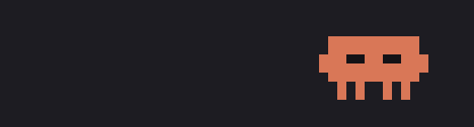
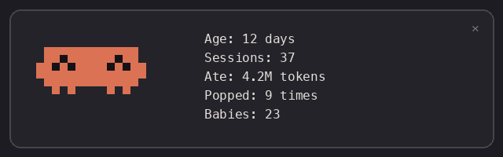

# Clawdgotchi

A pixel Clawd who lives in the corner above your Claude Code prompt and eats your context window.
The fuller the context, the fatter he gets. Near the limit he shakes and cracks.
Run `/compact` and he pops, sits as an egg while the compaction runs, and hatches small again.



There is no text in the band: Clawd is the gauge. Keep exact numbers in your status line.

## Stages



| Context | Stage | What he does |
|---|---|---|
| 0–24% | light | the logo Clawd, blinking and breathing |
| 25–49% | fed | wider, happy `^ ^` eyes |
| 50–74% | stuffed | taller, squinting, a drop of sweat |
| 75–89% | bloated | round, red cheeks, swaying side to side |
| 90%+ | about to pop | cracks, `×` eyes, flashing and shaking |

His feet never leave the ground: only the body moves.

## Life around him

**Working and eating.** While Claude works he sways and types. After each turn the new tokens fly in and he munches them.

**Popping on `/compact`.** He bursts, turns into an egg that wobbles for as long as the compaction runs, then hatches at the new, smaller size.



**Subagent babies.** Each running subagent stands beside him as a tiny Clawd (up to three) and leaves when it finishes.



**Sleep and night owl.** After 5 idle minutes he falls asleep at any hour: he lies perfectly still while `z z Z` float up beside him, and your next prompt wakes him. From 23:00 he gets sleepy, and from 02:00 to 06:00 he dozes off even while Claude works.



**Passport.** `/clawd` opens a panel with his age, sessions, tokens eaten, pops survived and babies. It is kept across sessions on your machine.



## Requirements

- Claude Code with mods. The docs list v2.1.287+; it was also tested on v2.1.284.
- Mods are in early access, so turn them on with `CLAUDE_CODE_ENABLE_FUNCTION_HOOKS=1`,
  either in your shell or under `env` in `~/.claude/settings.json`.
- A terminal. The Claude desktop app cannot draw the sprite, so the mod shows nothing there.
- If your terminal uses window transparency (iTerm2), Clawd still looks solid: he is drawn with glyph colors, not backgrounds.

## Install

Inside a Claude Code session:

```
/plugin install clawdgotchi --marketplace arthurseredaa/clawdgotchi
```

Or from your shell:

```bash
claude plugin marketplace add arthurseredaa/clawdgotchi
claude plugin install clawdgotchi@clawdgotchi
```

Update with `claude plugin update clawdgotchi@clawdgotchi`.

## Good to know

- Claude Code draws its own `[-]` in the corner of the band; it collapses the band (also `ctrl+x ctrl+a`).
- While a permission dialog or a question is open, Claude Code hides the band, so Clawd steps aside too.
- In a band shorter than four rows he hides instead of showing a scrolled sliver.

## Develop

```bash
git clone https://github.com/arthurseredaa/clawdgotchi
cd clawdgotchi
CLAUDE_CODE_ENABLE_FUNCTION_HOOKS=1 claude --plugin-dir .   # hot-reloads on save
claude plugin validate .
CLAUDE_CODE_ENABLE_FUNCTION_HOOKS=1 claude plugin test
python3 scripts/render-media.py                             # regenerates docs/media (Node + Pillow)
```

The first `claude --plugin-dir .` writes the mods API types for your Claude Code version to `.claude-plugin/types/` (git-ignored), which `tsconfig.json` uses for editor support.

Code layout: `hooks/clawdgotchi.mjs` wires events, state and drawing; `sprite.mjs` (pixels and animation), `cells.mjs` (pixels to terminal cells), `scene.mjs` (which animation plays) and `passport.mjs` are pure and unit-tested. The design is in `docs/spec.md`.

## Disclaimer

Unofficial fan project, not affiliated with or endorsed by Anthropic. Clawd is Anthropic's character.
No Anthropic logos are included.

## License

MIT
